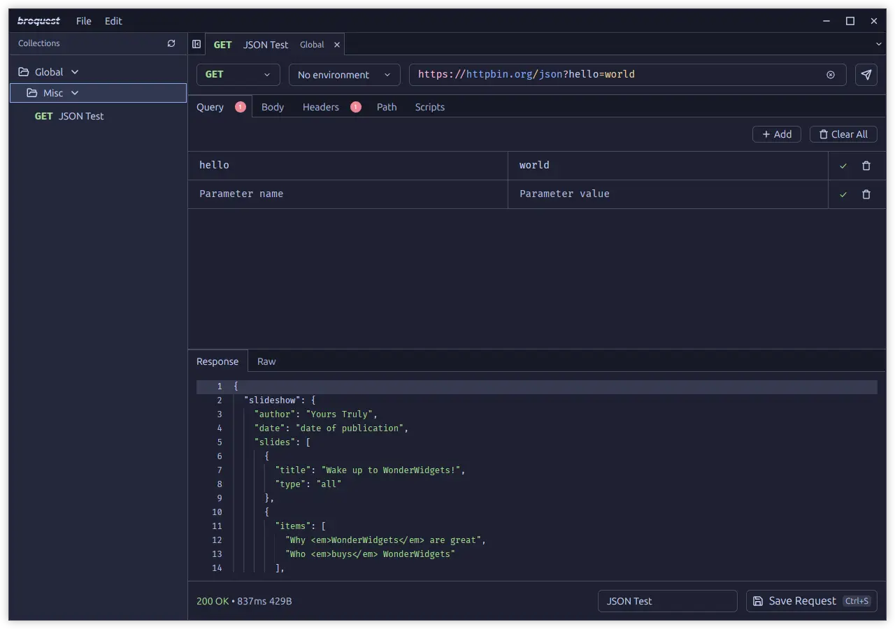

<picture>
  <source media="(prefers-color-scheme: dark)" srcset="docs/images/logo-dark.png">
  <source media="(prefers-color-scheme: light)" srcset="docs/image/logo-light.png">
  
</picture>
<hr><br>

A modern, native desktop API client built with [GPUI](https://www.gpui.rs) and [gpui-component](https://github.com/longbridge/gpui-component), offering fast performance and a clean interface for API development and testing.



## Features

- **Native Performance** - Built with Rust and GPUI for fast native performance
- **File-based Storage** - Collections and configurations stored in human-readable TOML files
- **Environment Management** - Support for multiple environments with variables and secrets
- **JavaScript Scripting** - Pre-request and post-response scripting using QuickJS
- **Modern UI** - Clean, responsive interface with theme support
- **Local-first** - All your data stays on your machine with no cloud dependencies
- **Cross-platform** - Available for Linux, macOS and Windows

## macOS

**IMPORTANT:** After downloading you have to run `xattr -r -d com.apple.quarantine Broquest.app` in the folder of the app since the app isn't notarized.

## Scripting

Broquest supports JavaScript scripting for pre-request and post-response hooks using [QuickJS](https://bellard.org/quickjs/) with [LLRT modules](https://github.com/awslabs/llrt) that provide Node.js-compatible APIs.

### Available Objects

#### `req` Object (Pre-request scripts)

The `req` object contains the current request data that can be modified before sending:

```javascript
// Request method (GET, POST, etc.)
req.method;

// Request URL
req.url;

// Request body
req.body;

// Headers object (read/write)
req.headers["Content-Type"] = "application/json";
req.headers.Authorization = "Bearer token";

// Query parameters object (read/write)
req.query.page = "1";
req.query.limit = "10";
```

#### `res` Object (Post-response scripts)

The `res` object contains the response data:

```javascript
// Response status code (200, 404, etc.)
res.status;

// Response status text ("OK", "Not Found", etc.)
res.statusText;

// Response body (string, or object if JSON)
res.body;

// Response headers object (read-only)
res.headers["content-type"];
res.headers["server"];

// Response latency in milliseconds
res.latency;

// Response size in bytes
res.size;
```

#### `bro` Object

The `bro` object provides utility functions for environment variable management:

```javascript
// Set environment variable
bro.setEnvVar("API_KEY", "your-api-key-here");

// Get environment variable (returns undefined if not found)
bro.getEnvVar("API_KEY");
```

#### Global Functions

##### Base64 Encoding/Decoding

```javascript
// Encode to base64
const encoded = btoa("hello world");

// Decode from base64
const decoded = atob("aGVsbG8gd29ybGQ=");
```

##### Crypto Operations

```javascript
// Generate UUID v4
const id = crypto.randomUUID();

// Create hash
const hash = crypto.createHash("sha256").update("data").digest("hex");
```

##### URL Operations

```javascript
// Parse URLs
const url = new URL("https://api.example.com/users/123?active=true");

// URL search parameters
const params = new URLSearchParams("?name=John&age=30");
params.append("city", "NYC");
params.get("name");
```

### Script Examples

#### Basic Authentication

```javascript
// Pre-request script for Basic Auth
req.headers.Authorization =
  "Basic " +
  btoa(`${bro.getEnvVar("merchantid")}:${bro.getEnvVar("password")}`);
```

#### Dynamic Headers

```javascript
// Pre-request script to set timestamp and signature
const timestamp = Date.now();
const payload = req.method + req.url + req.body + timestamp;

// Simple hash example (use crypto.createHash for real hashing)
const signature = crypto.createHash("sha256").update(payload).digest("hex");

req.headers["X-Timestamp"] = timestamp.toString();
req.headers["X-Signature"] = signature;
```

## License

Apache-2.0

- Icons from [Lucide](https://lucide.dev).
