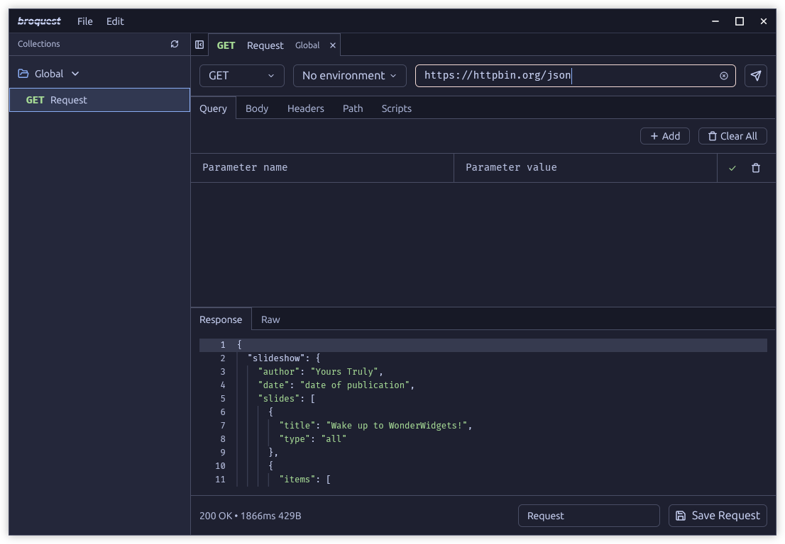

# Broquest

A modern, native desktop API client built with [GPUI](https://www.gpui.rs) and [gpui-component](https://github.com/longbridge/gpui-component), offering fast performance and a clean interface for API development and testing.

## Features

- **Native Performance** - Built with Rust and GPUI for fast native performance
- **File-based Storage** - Collections and configurations stored in human-readable TOML files
- **Environment Management** - Support for multiple environments with variables and secrets
- **JavaScript Scripting** - Pre-request and post-response scripting using QuickJS engine
- **Modern UI** - Clean, responsive interface with theme support
- **Local-first** - All your data stays on your machine with no cloud dependencies
- **Cross-platform** - Available for Linux (more builds coming soon!)

## License

Apache-2.0

- Icons from [Lucide](https://lucide.dev).
